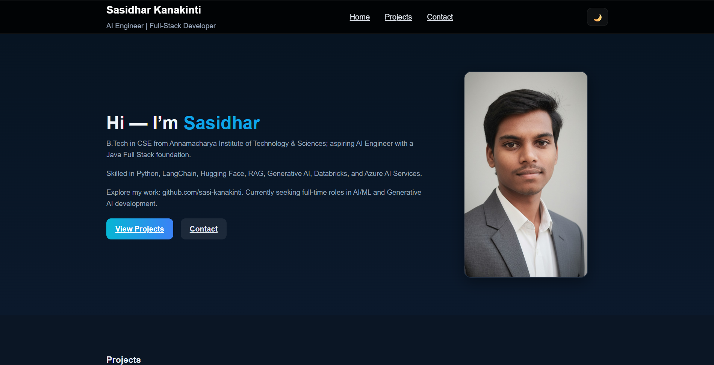
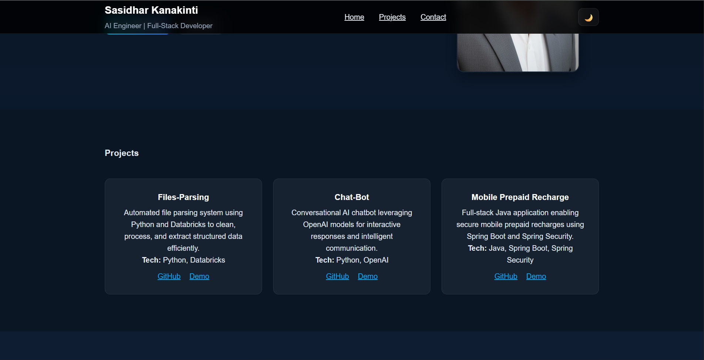
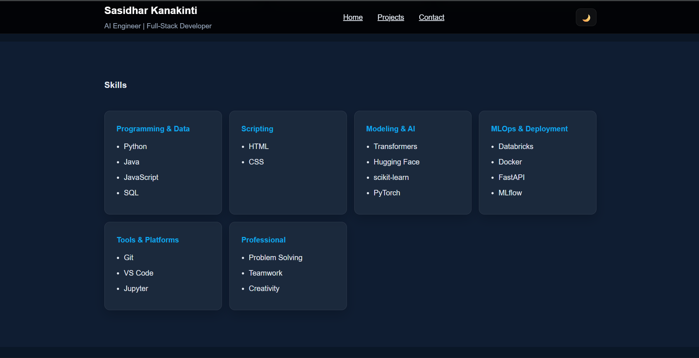
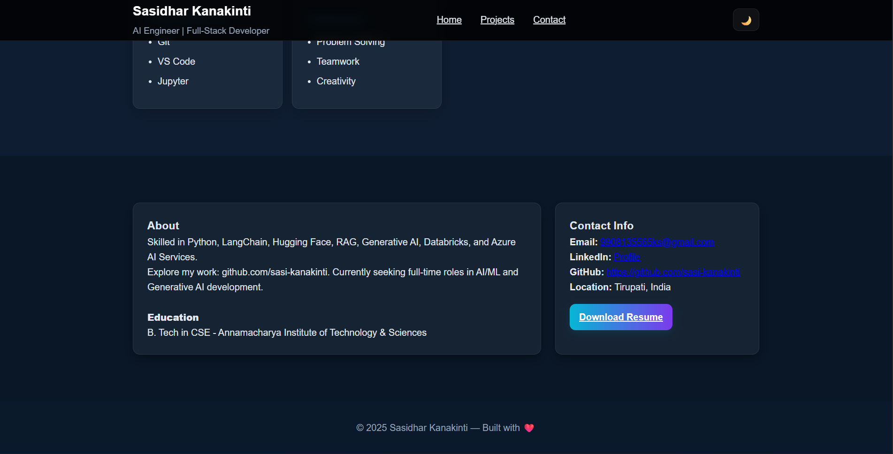
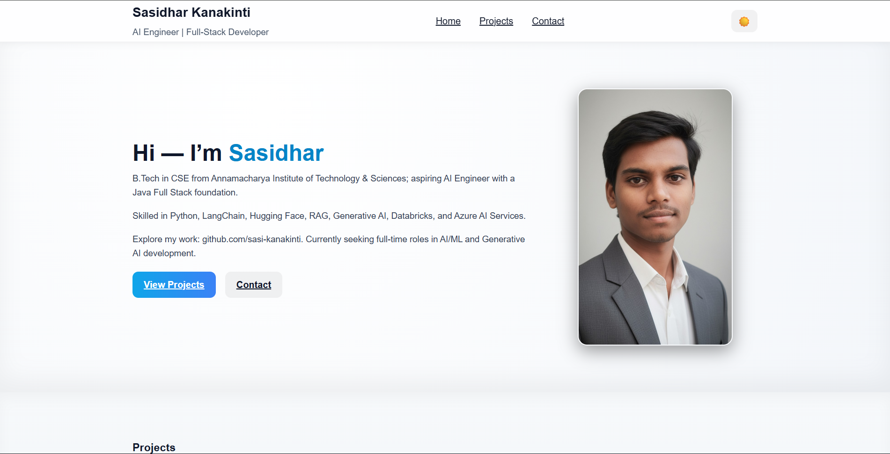
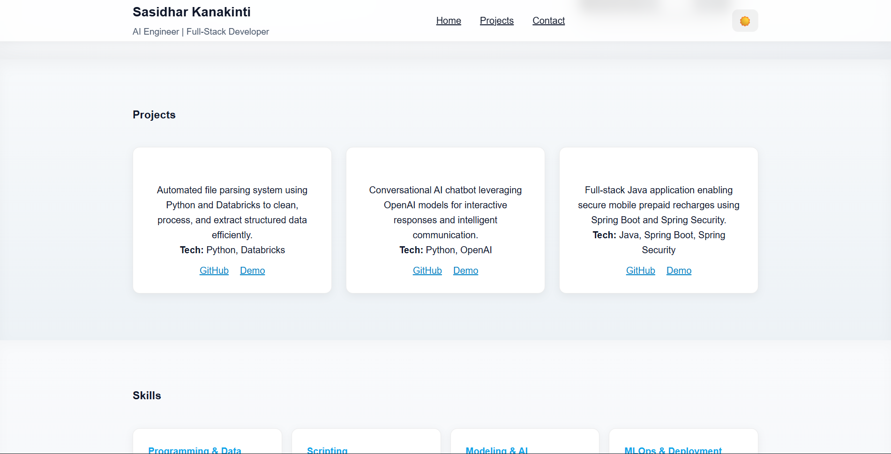
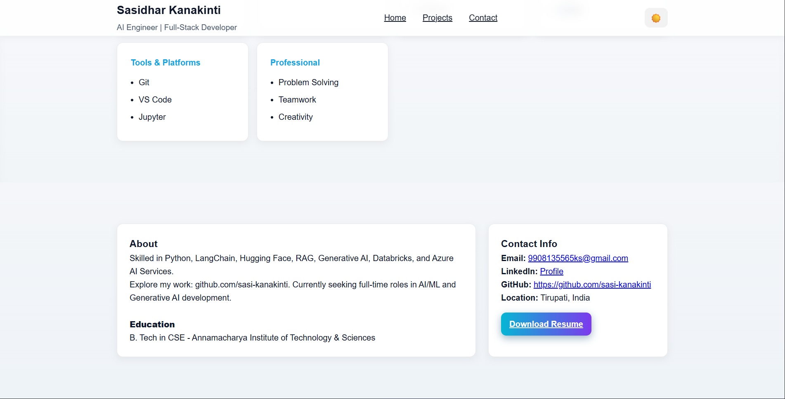

# 🚀 Portfolio Demo

A modern and minimal **personal portfolio website** built with **React + Vite** — designed to showcase projects, skills, and achievements with a clean and elegant UI.

---

## 🌐 Live Demo

👉 [View Deployment](https://portfolio-demo-basic.vercel.app/)

---

## 🖼️ Previews

### Dark Mode
| Preview | |
|----------|--|
|  |  |
|  |  |

### Light Mode
| Preview | |
|----------|--|
|  |  |
|  |  |

---

## 🛠️ Tech Stack

- ⚡ **React + Vite** — Fast, modern frontend setup  
- 💡 **Framer Motion** — For smooth animations  
- 🌙 **Dark/Light Theme** — Switchable UI themes  
- 📱 **Fully Responsive** — Mobile-first design  

---

## 📁 Folder Structure

```
portfolio-demo/
│
├── public/
│   └── op/
│       ├── b1.png
│       ├── b2.png
│       ├── b3.png
│       ├── b4.png
│       ├── w1.png
│       ├── w2.png
│       └── w3.png
│
├── src/
│   ├── components/
│   ├── pages/
│   ├── assets/
│   ├── App.jsx
│   └── main.jsx
│
├── package.json
├── vite.config.js
└── README.md
```

---

## ⚙️ Setup & Installation

To run this project locally:

```bash
# Clone the repository
git clone <repository-url>

# Navigate to the project directory
cd portfolio-demo

# Install dependencies
npm install

# Start the development server
npm run dev
```

Your app should now be live at `http://localhost:5173`.

---

## 🚀 Deployment

The site is deployed using **Vercel**.  
You can deploy your own version easily:

1. Push the code to a GitHub repository.  
2. Go to [Vercel](https://vercel.com/).  
3. Import your repo and click **Deploy**.  

---

## 📄 License

You’re free to use the structure or UI ideas for your personal projects - MIT.

---

## 💬 Attribution

© 2025 Sasi Kanakinti — Built with ❤️ using **React**, **Vite**.

---
